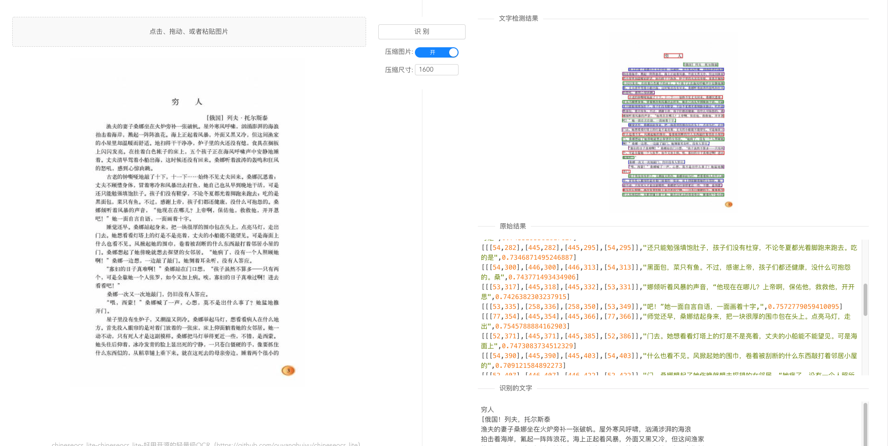
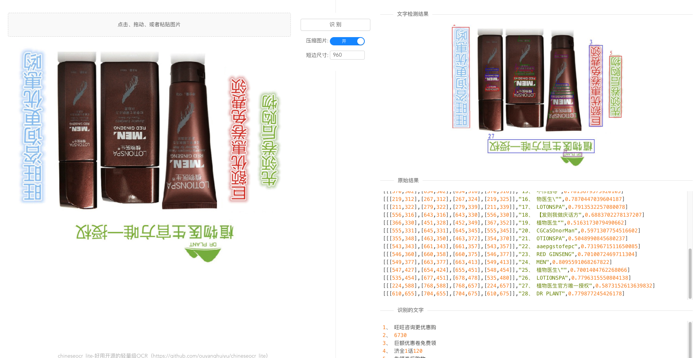
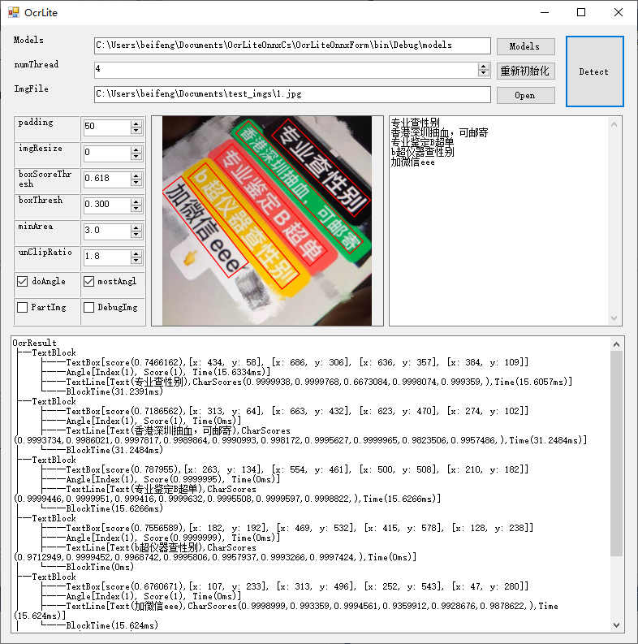
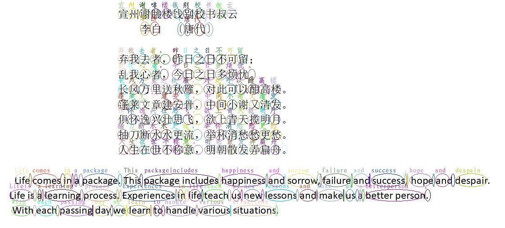
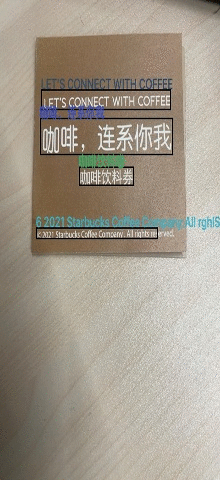
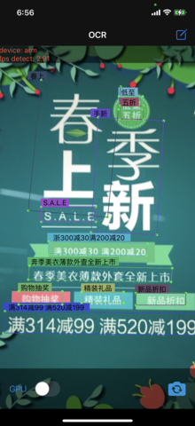
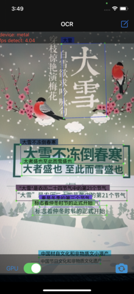

# chineseocr_lite 的 onnx 推理, 部署简单

## 原始项目分支（torch推理，ncnn推理等）：[master](https://github.com/ouyanghuiyu/chineseocr_lite/tree/master)

## 环境
- python3.6

- linux/macos/windows

## web服务启动
``` Bash
cd chineseocr_lite## 进入chineseocr目录
python backend/main.py 
```

## 识别结果展示



## 参考
1. TrWebOCR https://github.com/alisen39/TrWebOCR         

## QQ群
820075525

### 以下范例项目是参考Python代码翻译为各种语言的Demo，仅供参考
** 注意：以下各种demo均相互独立，只是同一个程序的不同版本 **
#### **如果不想自己整合依赖库的话，以下demo的完整源码工程项目，请到Q群共享里自行下载**
#### [C++ Demo](https://github.com/ouyanghuiyu/chineseocr_lite/tree/onnx/cpp_projects)
* onnxruntime C++ demo，支持Windows、linux、macOS，目前仅支持cpu计算；
* ncnn C++ demo，支持Windows、linux、macOS，分为cpu版与gpu版，gpu版使用ncnn+vulkan来支持gpu加速；
* MNN C++ demo, 支持 windows、linux、macOs，目前仅支持cpu计算；

#### [Jvm Demo](https://github.com/ouyanghuiyu/chineseocr_lite/tree/onnx/jvm_projects)
* onnxruntime jvm demo: 以onnxruntime C++为基础，编译成jni供java或kotlin调用；
* ncnn jvm demo: 以ncnn C++为基础，编译成jni供java或kotlin调用，同样分为cpu版与gpu版；

#### [Android Demo](https://github.com/ouyanghuiyu/chineseocr_lite/tree/onnx/android_projects)
* onnxruntime android demo: 以onnxruntime C++为基础，整合为一个独立的android模块供app调用；
* ncnn jvm android demo: 以ncnn C++为基础，整合为一个独立的android模块供app调用，同样分为cpu版与gpu版；
* MNN android demo: 以MNN C++为基础，整合为一个独立的android模块供app调用，支持cpu版本

#### [.Net Demo](https://github.com/ouyanghuiyu/chineseocr_lite/tree/onnx/dotnet_projects)
* onnxruntime c# demo:  完全以C#编写的onnxruntime demo;
* onnxruntime vb.net demo: 完全以VB编写的onnxruntime demo;

#### [字符检测ocr Demo](https://github.com/fanqie03/char-detection)
* 根据本项目和CRNN原理，推到出每个字符的位置demo，包括将字符组合成单词。

#### 第三方Demo
* [TNN中文字符ocr](https://github.com/Tencent/TNN/#effect-example): 根据本项目，基于TNN实现的轻量级中文字符ocr demo，支持iOS和Android系统，凭借TNN优化的CPU(ARMv7、ARMv8)和GPU(OpenCL、Metal)后端加速模型计算。


### Android识别展示


### .NetDemo识别展示


### 字符检测ocr Demo识别展示


### 第三方 TNN Demo识别展示
[](https://github.com/Tencent/TNN/#effect-example)
[](https://github.com/Tencent/TNN/#effect-example)
[](https://github.com/Tencent/TNN/#effect-example)
