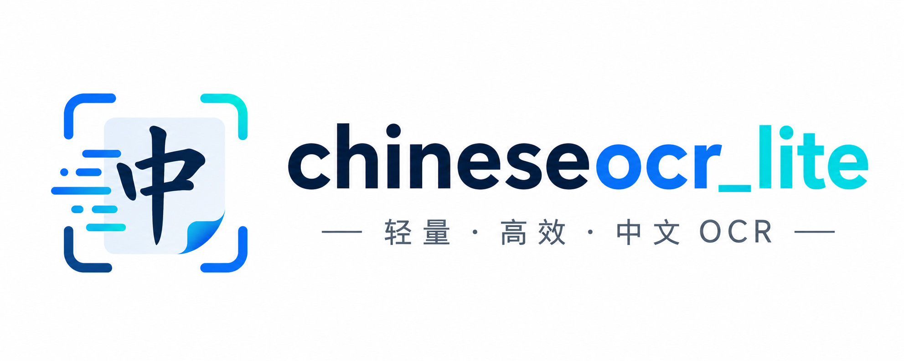
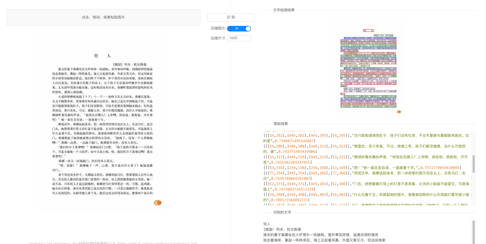
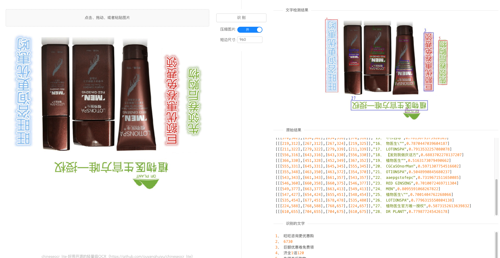
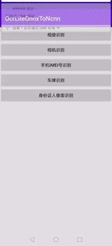
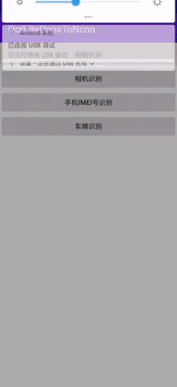
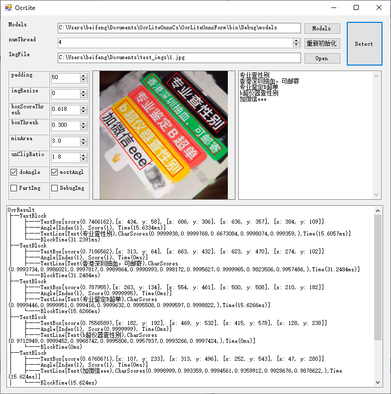
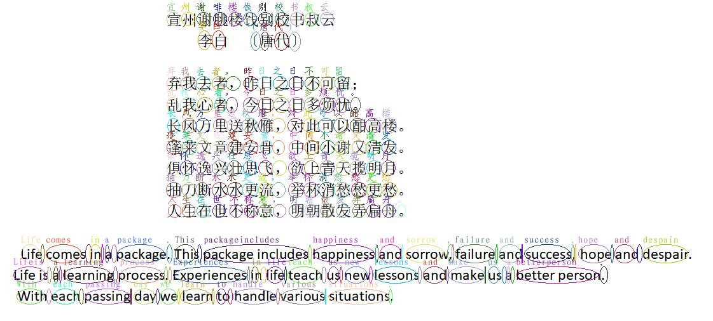
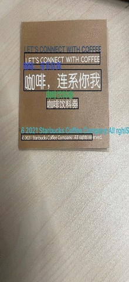
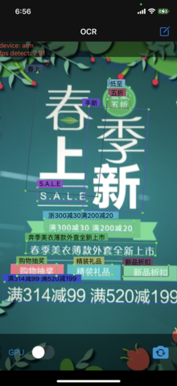
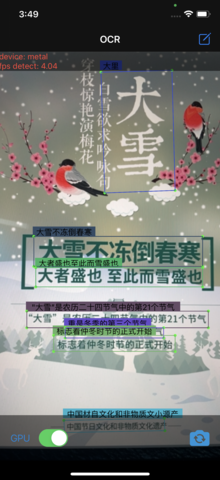

<p align="center">
  
</p>

<p align="center">
  <a href="#cli-使用">CLI</a> ·
  <a href="#启动-web-服务">Web Demo</a> ·
  <a href="#模型文件">Models</a> ·
  <a href="#多端-demo">Multi-platform Demo</a>
</p>

轻量级中文 OCR 项目，当前分支以 ONNX Runtime 推理为主，包含 Web 服务、Python 推理代码，以及 C++、JVM、Android、.NET 等多端 Demo。

## 功能

- 中文 OCR 文字检测与识别
- ONNX Runtime CPU 推理
- Tornado Web 服务与前端展示页面
- Android、C++、JVM、.NET 多端参考 Demo
- 附带轻量模型文件，便于本地快速试跑

## 环境

推荐环境：

- Python 3.6
- Windows、Linux 或 macOS
- CPU 推理，无需 CUDA

安装依赖：

```bash
pip install -r requirements.txt
```

## 启动 Web 服务

```bash
cd chineseocr_lite
python backend/main.py
```

服务默认监听 `8089` 端口。启动后终端会输出类似：

```text
server is running: 192.168.x.x:8089
```

在浏览器打开该地址即可使用 Web OCR 页面。

## CLI 使用

当前项目也可以作为命令行 OCR 工具使用，适合被 agent、脚本或批处理任务调用。

本地开发安装：

```bash
pip install -e .
```

识别单张图片并输出 JSON：

```bash
chineseocr test_imgs/res.jpg
```

写入 JSON 文件：

```bash
chineseocr test_imgs/res.jpg --output result.json
```

同时输出带检测框的图片：

```bash
chineseocr test_imgs/res.jpg --output result.json --draw result.jpg
```

调整检测前的短边尺寸：

```bash
chineseocr test_imgs/res.jpg --compress 960
```

CLI 输出为稳定 JSON，便于 agent 解析：

```json
{
  "text": "识别出的全文",
  "blocks": [
    {
      "text": "单个文本块",
      "score": 0.93,
      "box": [[12, 30], [210, 31], [209, 60], [11, 59]]
    }
  ],
  "elapsed": 1.24
}
```

也可以用 Python 模块方式运行：

```bash
python -m chineseocr_lite test_imgs/res.jpg
```

## 模型文件

当前仓库包含基础推理模型：

| 目录 | 文件 | 用途 |
| --- | --- | --- |
| `models/` | `dbnet.onnx` | 文本检测 |
| `models/` | `crnn_lite_lstm.onnx` | 文本识别 |
| `models/` | `angle_net.onnx` | 文字方向分类 |
| `models_ncnn/` | `*.bin`, `*.param` | NCNN Demo 使用的模型 |

作为 Python CLI 包安装时，`models/*.onnx` 会随包一起安装，CLI 开箱即可使用。`models_ncnn/` 和各端 Demo 不会作为 CLI 必需资源。

不要把训练权重、Python wheel、大型第三方库或构建产物直接提交到 Git。推荐放到 GitHub Releases、对象存储或 Git LFS。

## 项目结构

```text
.
├── backend/             Web 服务与接口
├── models/              ONNX 模型
├── models_ncnn/         NCNN 模型
├── dbnet/               文本检测相关代码
├── crnn/                文本识别相关代码
├── angnet/              方向分类相关代码
├── cpp_projects/        C++ Demo
├── jvm_projects/        JVM Demo
├── android_projects/    Android Demo
├── dotnet_projects/     .NET Demo
├── test_imgs/           示例图片与效果图
├── config.py            模型与推理配置
├── model.py             OCR 推理入口
└── utils.py             通用工具函数
```

## 多端 Demo

以下 Demo 均为参考 Python 版本翻译或封装而来，彼此相互独立。

### C++ Demo

目录：[cpp_projects](cpp_projects/README.md)

- ONNX Runtime C++ Demo，支持 Windows、Linux、macOS，目前仅支持 CPU
- NCNN C++ Demo，支持 Windows、Linux、macOS，包含 CPU 版与 Vulkan GPU 版
- MNN C++ Demo，支持 Windows、Linux、macOS，目前仅支持 CPU

### JVM Demo

目录：[jvm_projects](jvm_projects/README.md)

- ONNX Runtime JVM Demo，基于 ONNX Runtime C++ 编译 JNI 供 Java/Kotlin 调用
- NCNN JVM Demo，基于 NCNN C++ 编译 JNI 供 Java/Kotlin 调用，包含 CPU 版与 GPU 版

### Android Demo

目录：[android_projects](android_projects/README.md)

- ONNX Runtime Android Demo
- NCNN Android Demo，包含 CPU 版与 GPU 版
- MNN Android Demo，支持 CPU 版

如果不想自行整合依赖库，完整源码工程可到 QQ 群共享中下载。

### .NET Demo

目录：[dotnet_projects](dotnet_projects/README.md)

- ONNX Runtime C# Demo
- ONNX Runtime VB.NET Demo

### 字符检测 OCR Demo

第三方项目：[fanqie03/char-detection](https://github.com/fanqie03/char-detection)

根据本项目和 CRNN 原理推导每个字符的位置，并支持将字符组合成单词。

### TNN 第三方 Demo

第三方项目：[Tencent/TNN OCR 示例](https://github.com/Tencent/TNN/#effect-example)

基于本项目实现的轻量级中文 OCR Demo，支持 iOS 和 Android，使用 TNN 的 ARM CPU、OpenCL、Metal 后端加速模型计算。

## 效果展示

### Web 识别





### Android 识别






### .NET 识别



### 字符检测 OCR



### TNN 第三方 Demo

[](https://github.com/Tencent/TNN/#effect-example)

[](https://github.com/Tencent/TNN/#effect-example)

[](https://github.com/Tencent/TNN/#effect-example)


## 作者项目

- [UnWatermark AI](https://unmarkai.net/)：在线视频水印去除工具，适合处理短视频、素材和内容发布前的清理工作。

## QQ 群

合作联系QQ： 760997646
