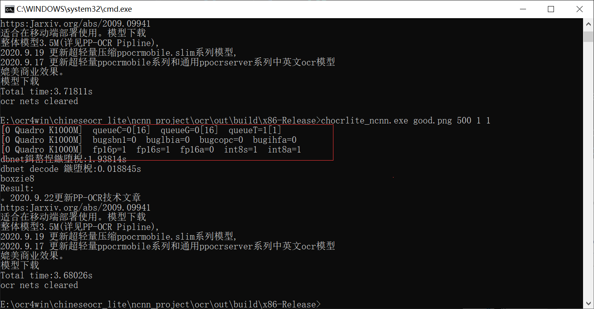
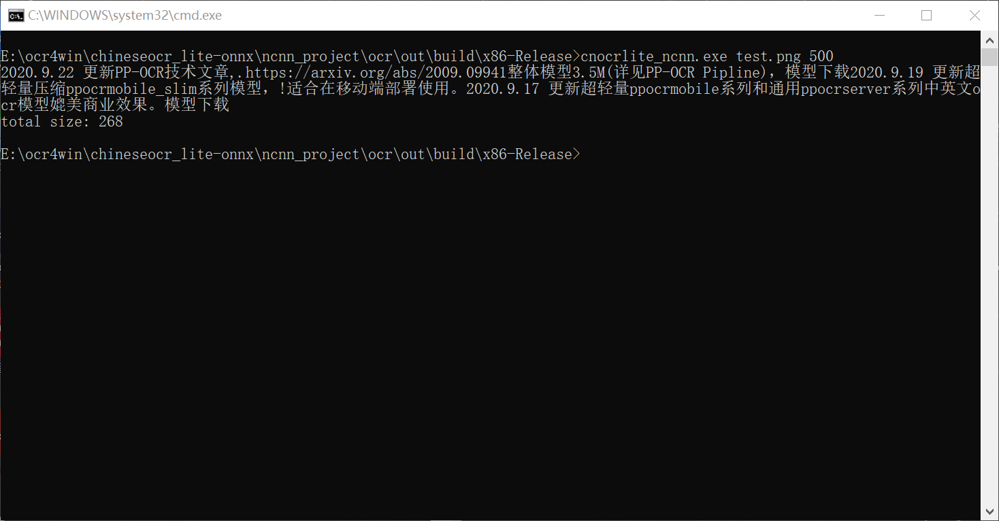

## ncnn版本维护修改

修改了 命令行接口，添加了使用示例。

添加 新的库函数，方便其它程序调用。

主程序改为调用新加的库函数，以演示使用方法。

2020.10.08  

加入GPU支持，优化了测试程序大小。

在支持GPU的机器上，可以用命令行打开gpu 开关。注意，在某些机器上启用gpu可能更慢。

接口库加入gpu支持。具体参见 测试程序中的调用方式。

#### 特别说明：

打开GPU后有可能会更慢，原因是数据从内存搬移到显存需要时间，当网络复杂度不够时，搬移数据的时间远大于推理时间，这将导致启用GPU可能更慢。

### 运行效果

命令行参数：

第一个： 图片路径

第二个： 长边长度

第三个：verbose模式开关 （默认或０为关闭，１为打开）

第四个： GPU 模式开关 （默认或０为关闭，１为打开）

#### 有GPU

#### 无gpu

## 目前编译环境：

### Windows:

visual studio 2019 +ncnn 最新版本。

在Windows下平台下，准备好库后，直接用vs2019打开cmake的方法打开cmakelist.txt 文件即可编译。

### Linux:

cmake +ncnn 最新版本

请修改目录下的CMakeList.txt 以适配你的环境，主要是opencv及vulkan的头文件或库文件目录路径。

动态库支持Windows /Linux
